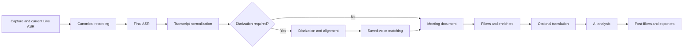

# Meet2Notes roadmap

Meet2Notes is being built as a private, extensible meeting-intelligence
workspace. The repository will become public when the application, extension
API, upgrade path, and security defaults are mature enough for community use.

This roadmap records product direction as well as implementation milestones.
Items marked completed describe functionality already available in the current
source tree; planned items are deliberately split into testable phases.

## Product principles

1. **Keep capture dependable.** The existing local live transcription uses
   short overlapping windows and remains independent from the final pipeline.
   A remote processor must never be required to record a meeting.
2. **Preserve originals.** Recordings, final transcripts, and speaker turns are
   canonical artifacts. Filters and translations create derived artifacts and
   never silently overwrite their source.
3. **Depend on capabilities, not brands.** The workflow asks for a final
   transcript, timestamps, speaker turns, an analysis document, or an export.
   Whisper, Parakeet, Nemotron, Qwen, MOSS, VibeVoice, a Hugging Face adapter,
   or a remote server may provide those capabilities.
4. **Local first, location independent.** A processing stage may run in the
   current process, an isolated local worker, another PC with a GPU, or an
   explicitly selected remote provider.
5. **Extensions use a stable API.** Community plugins register engines,
   actions, filters, processors, and exporters without monkey-patching core
   modules or accessing the Meet2Notes database directly.
6. **Privacy is visible.** The UI must show where each stage runs and whether
   audio or text leaves the computer.

## Target processing model

Live transcription remains as it is today. Modular processing begins after
the user presses Stop or imports a media file:

Every stage declares its inputs, outputs, execution target, progress,
cancellation behavior, retry policy, and capabilities. A composite engine may
satisfy several stages. For example, an end-to-end model that returns text,
timestamps, and speaker labels can skip the separate diarization stage.

The shared `MeetingDocument` contract contains timestamped transcript segments,
speaker references, language information, derived variants, metadata, and
artifact provenance. Model-specific output is normalized at the adapter
boundary.

## Extension model

Meet2Notes exposes two WordPress-inspired hook families:

- **Actions** observe lifecycle events without replacing data. Examples include
  `final_transcription.completed`, `diarization.completed`,
  `analysis.completed`, and `pipeline.finished` (plus failure and cancellation
  variants for terminal stages).
- **Filters** receive a typed artifact and return a transformed artifact.
  Examples include `analysis.before` for translation, redaction, terminology,
  or cleanup, and `analysis.after` for Markdown post-processing.

Hooks execute deterministically by priority. Each invocation has a timeout,
failure policy, cancellation context, structured log, input/output digest, and
plugin version. Optional failures are recorded and skipped; required failures
stop the affected stage.

Python packages advertise plugins through the standard
`meet2notes.plugins` entry-point group. A plugin manifest declares:

- Stable ID, name, author, version, and description.
- Meet2Notes and plugin-API compatibility.
- Hooks and engine capabilities.
- Permissions such as network, recording access, transcript access, or secret
  storage.
- Settings schema and whether an isolated runtime is required.

Installed plugins can be discovered, enabled, disabled, diagnosed, and
rescanned from Settings. Third-party packages will ultimately run in isolated
workers with their own dependency environment. Official trusted extensions may
opt into in-process execution. Provider secrets use the operating-system
keyring.

### Example community extensions

- Translation before AI analysis while retaining the original transcript.
- PII or secret redaction.
- Domain dictionaries, hotwords, and terminology correction.
- Sentiment, topic, compliance, or risk enrichers.
- Additional final ASR, diarization, or LLM providers.
- Markdown, subtitle, CRM, task-manager, or knowledge-base exporters.
- Notifications and post-meeting automation.

## Deployment roles

The target distribution supports three roles from the same codebase:

| Role | Responsibilities |
|---|---|
| `all-in-one` | Web UI, capture, live ASR, storage, and final processing on one computer |
| `client` | Web UI, capture, live ASR, canonical data, and orchestration; final stages may use another node |
| `processing-node` | Inference workers and model cache without access to the meetings database or UI |

Final batch work uses authenticated HTTP jobs, resumable media upload, SSE
progress, and explicit cancellation. A processing node returns normalized
artifacts rather than writing into the client's database. TLS, pairing tokens,
capability negotiation, protocol versions, sequence checks, and visible data
location are mandatory before remote mode is enabled outside localhost.

## Completed foundation

- Native microphone, audio-interface, and available system-audio capture.
- Stable overlapping-window live transcription plus an independent final pass.
- Selectable Faster Whisper, NVIDIA, and VibeVoice BitNet final ASR adapters.
- Runtime-aware CPU/CUDA settings and independently resident workers.
- Sherpa-ONNX, Pyannote Community-1, and isolated `diarize` diarizers.
- Shared saved-voice matching independent from the selected diarizer.
- Managed llama.cpp models, custom GGUF, and local/remote LiteLLM analysis.
- Secure LiteLLM credentials through the operating-system keyring.
- Structured note formats with built-in and custom templates.
- Meeting and speaker workspaces, per-speaker exports, and summaries.
- CPU/CUDA installers, in-app CUDA upgrade, model lifecycle actions, safe
  shutdown, instance locking, dark theme, and hardware diagnostics.
- Reproducible ASR and diarization evaluators with permanent JSON ledgers.

## Phase 1: final-pipeline and plugin foundation

- [x] Preserve the existing live transcription behavior and settings.
- [x] Introduce typed meeting-document and analysis artifacts.
- [x] Replace the queue's implicit post-processing callback with an explicit
  final-pipeline coordinator.
- [x] Add actions, filters, priorities, timeouts, and failure policies.
- [x] Discover plugins through Python entry points and first-party manifests.
- [x] Persist plugin execution provenance without storing private content.
- [x] Add Settings management for discovery, enable/disable, permissions,
  compatibility, hooks, and recent errors.
- [x] Ship a harmless reference filter and a community plugin example.
- [x] Publish the versioned plugin API and contribution guide.
- [x] Define an informational JSON list for independently maintained community
  plugins and an issue-based listing workflow.

## Phase 2: richer local pipelines

- [ ] Model pipeline runs and derived artifacts explicitly in SQLite.
- [ ] Add a visual per-meeting stage timeline and retry controls.
- [ ] Allow filter ordering within safe, typed hook slots.
- [ ] Add optional translation and redaction plugins.
- [x] Register final/live ASR, diarization, analysis, and embedding providers
  through the same lazy extension registry used by built-ins.
- [x] Support composite providers that emit transcript plus speaker turns.
- [ ] Register typed export providers and destination presets.
- [ ] Cache deterministic processor output by input digest, configuration, and
  plugin version.
- [ ] Add Markdown, TXT, JSON, SRT, and VTT exporters.

## Phase 3: processing nodes

- [ ] Extract the final-stage executor into `meet2notes-processing-node` while
  retaining the all-in-one launcher.
- [ ] Add node pairing, health, capabilities, model inventory, and queue limits.
- [ ] Implement authenticated resumable upload and normalized artifact return.
- [ ] Select an execution node independently for final ASR, diarization,
  translation, analysis, and export.
- [ ] Recover safely from disconnection while retaining the canonical local
  recording.
- [ ] Add a privacy badge showing `This computer`, a named private node, or a
  cloud provider for every stage.

## Phase 4: community ecosystem and updates

- [ ] Run untrusted plugins in isolated environments with resource limits.
- [ ] Add signed plugin packages, checksum verification, staged upgrades, and
  rollback.
- [ ] Support plugin install, enable, disable, upgrade, and uninstall lifecycle
  hooks without running arbitrary code during a core database migration.
- [ ] Publish an extension SDK, JSON schemas, test harness, compatibility
  matrix, examples, and review checklist.
- [ ] Replace the informational repository list with a signed, curated plugin
  index distributed independently from the core release.
- [ ] Add signed desktop installers and safe application updates.
- [ ] Open the repository publicly with security policy, governance,
  contribution workflow, issue templates, and a stable Plugin API v1.

## Release gates before public launch

- No known data-loss path in capture, import, migration, or model uninstall.
- Backward-compatible migrations with tested rollback/recovery guidance.
- Plugin permissions and execution location clearly visible to users.
- Third-party code disabled by default until explicitly enabled.
- Secrets absent from SQLite, logs, diagnostics, exports, and plugin payloads.
- Stable extension contracts with semantic versioning and compatibility errors.
- Windows CPU and CUDA installation tested from a clean machine; Linux and
  macOS core workflows documented and exercised in CI.
- Public security reporting process, code of conduct, license review, and
  contributor documentation complete.

## Longer-term product work

- Native macOS Core Audio Tap support for desktop audio.
- Local semantic search and meeting chat.
- Editable merge/split speaker tools and richer speaker identity management.
- Multi-client processing-node scheduling and resource-aware routing.
- Optional native streaming engines only if they do not compromise the stable
  current live-transcription experience.
